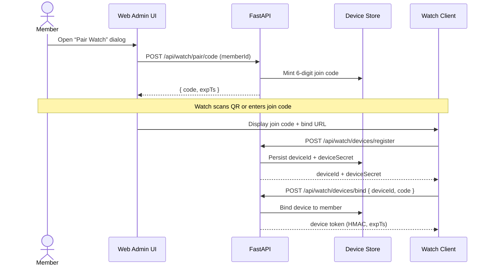
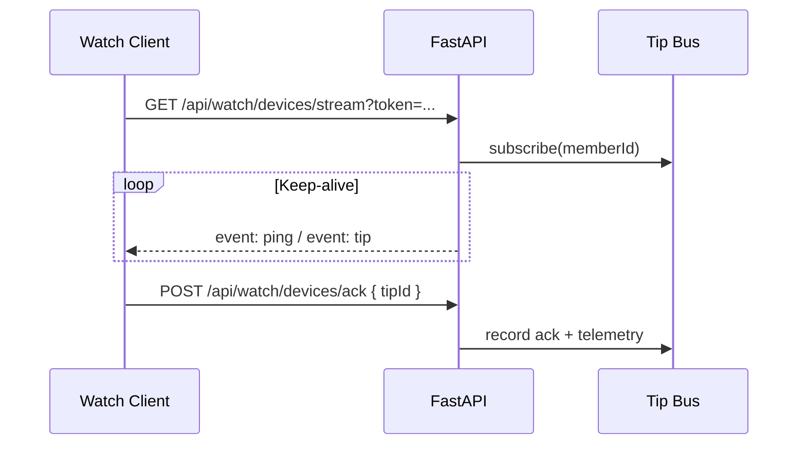

# Watch Pairing Quickstart

This guide describes the join-code pairing flow for watches, device authentication tokens, SSE delivery, and ACK telemetry for GolfIQ.

## 1. Pairing sequence

## 2. Streaming and ACKs

## 3. Security notes

- Device tokens are HMAC-SHA256 signatures of `deviceId.expTs` using the stored `deviceSecret`.
- Tokens expire quickly (default 5 minutes) and refresh requires `deviceSecret`.
- Join codes expire after 3 minutes and are invalidated on successful bind.
- Devices can rotate secrets (`rotate_device_secret`) or be unbound server-side if needed.
- All endpoints enforce lightweight IP-based rate limiting.

## 4. Platform bridge implementation tips

### watchOS (via iPhone bridge)

1. On the iPhone companion, request the join code using the member’s API key and relay it to the watch via `WCSession`.
2. The watch registers and binds through the phone (or the phone performs HTTP calls on behalf of the watch).
3. Deliver SSE tips on the phone (using the device token) and push payloads to the watch via `WCSession` messaging.
4. ACKs can be proxied back from the watch to the phone and posted to `/api/watch/devices/ack`.

### Wear OS (via Android phone)

1. Use the Android companion app to request join codes and persist device credentials in the encrypted data layer.
2. Bind the watch by sharing the six-digit code or scanning the bind QR from the GolfIQ admin UI.
3. Stream SSE tips on the Android phone (using OkHttp/EventSource) and forward relevant messages via the Wear OS data layer.
4. Acknowledge tips by posting `/api/watch/devices/ack` with the bearer token whenever the watch confirms receipt.

Telemetry emitted for the flow:

- `watch.pair.request` when the member requests a code.
- `watch.pair.complete` when the device binds successfully.
- `watch.stream.open` / `watch.stream.close` around SSE lifecycle.
- `watch.tip.ack` when the watch acknowledges a tip.
