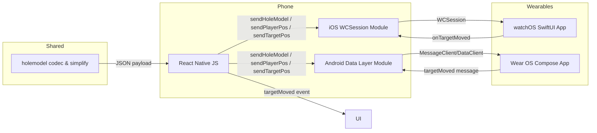

# Watch Bridge v1 Overview

## Architecture

## Message Types

| Path / Event | Direction | Payload | Notes |
| --- | --- | --- | --- |
| `/holeModel` | Phone → Watch | `{ json: string, tournamentSafe: boolean }` | Vector model + tournament flag |
| `/playerPos` | Phone → Watch | `{ lat: number, lon: number }` | Updates at 1 Hz while moving |
| `/targetPos` | Phone → Watch | `{ lat: number, lon: number, tournamentSafe?: boolean }` | Idle cadence at 0.33 Hz |
| `/targetMoved` | Watch → Phone | `{ lat: number, lon: number }` | Fired after drag/tap adjustments |
| `WatchTargetMoved` | Native → JS | `{ lat: number, lon: number }` | Shared emitter for iOS & Android |

## Update Cadence

* Player movement throttled to 1 Hz using motion detection on both watch connectors.
* Idle redraw requests scheduled every 3 s to limit refresh cost (≈0.33 Hz).

## Tournament Safe Handling

When `tournamentSafe` is `true`, hole overlays suppress plays-like / coach layers, rendering only fairway/green/bunker geometry.
